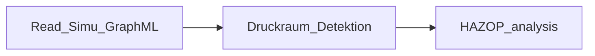

# Automated HAZOP analysis & risk analysis
The concept of this automated HAZOP analysis & risk analysis tool is based on preHAZOP (see preHAZOP [^1]). 

Optimization points of automated preHAZOP:

- Based on pressure zones
- Analysis with a relational SQL database
- Process medium is considered
- Self-integrated scenarios such as reactor runaway scenario; corrosion scenario for piping and equipment


Figure 1: Automated HAZOP Analysis Flow Sheet

## Authors:


Ruolan Yang, Jonas Oeing

TU Dortmund University, [Laboratory of Equipment Design](https://ad.bci.tu-dortmund.de/cms/en/laboratory/)

***
## Install:

- Install Python (anaconda) from https://www.anaconda.com/products/individual (Python 3.9.15)

- Install MySQL from https://dev.mysql.com/downloads/, for windows [^2]: 
    1. select *MySQL Installer for Windows*.
    2. select first *Windows (x86, 32-bit), MSI Installer 2.4M* to *Download*. 
    3. select *No thanks, just start my download*.
    4. select Setup Type: *Custom*.
    5. select Products: MySQL Server; MySQL Workbench; MySQL Shell (select the latest version).
    6. Next -> Excute -> Next
    7. Accont and Roles: select your password.
    8. Next -> Finish
    9. Go to MySQL Workbench, Connect to MySQL Server, you need to enter your password.
    10. You can now work with the SQL database :)

- Load the following python libraries:
  - NetworkX (vers. 2.8.8) [^3]
  - Matplotlib (vers. 3.6.2) [^4]
  - mysql.connector (vers. 8.0.31) [^5]
  - Other libraries are included with Python

- Load all_codes.zip from https://github.com/TUDoAD/Abschlussarbeiten_Oeing/blob/main/Yang/Results/Code/all_codes.zip

- Load XML zips from https://github.com/TUDoAD/Abschlussarbeiten_Oeing/tree/main/Yang/Results/XMLs

- Place scripts with XMLs in one folder

***
## Manual:

Here is the sequence of the HAZOP & risk analysis:


### *Read_Simu_GraphML* --- Integration of GraphML file and simulation results file

1. Run the script in Python.
2. Enter file names for GraphML and simulation results. for example: *CSTR_plant_GraphML* and *CSTR_Simulation*.


Figure 2: Graphical user interface for the *Read_Simu_GraphML*

3. Click *Enter data*; if the files exist, the Messenger box will tell you that you can close the window.

4. The new file *XX_Graphl_Plus* is created.

* Notice, if you want to try a new process, please make sure:

  * In the simulation result, all flows (edges) around the equipment must be available, otherwise it is not possible to analyse the leakage risk of the equipment.

  * In the first line of the simulation result, the *encoding* must be *utf-8*.
```xml
  <?xml version="1.0" encoding="utf-8"?>
```


### *Druckraum_Detektion* --- Prepare pressure zones for HAZOP & risk analysis

1. Run the script in Python.
2. Enter file name for *XX_Graphl_Plus*.


Figure 3: Graphical user interface for the *Druckraum_Detektion*

3. The pressure zone results are stored in a new created folder *Druckraum_XX*.


### *HAZOP & Risk analysis*

1. Load prepare for HAZOP.zip from https://github.com/TUDoAD/Abschlussarbeiten_Oeing/blob/main/Yang/Results/Datenbank/SQLs/prepare%20for%20HAZOP.zip.

2. unzip the file.

3. Go to MySQL Workbench and import the sql files.


Figure 4: MySQL Workbench data import guide

5. Create a new schema to store your HAZOP results:
```sql
  CREATE DATABASE `hazop_result`
```
6. Open the script HAZOP_analysis_Yang.

7. Input all your Database information
```python
#Change the following information to connect to your MySQL server: host, port, user, password, database name.
#First connection to the schema where all substance and scenario information is stored.
connection_1 = mysql.connector.connect(host = 'localhost',
                                     port = '3306',
                                     user = 'root',
                                     password = 'XXXXXXXX',database='hazop_analyse')

cursor_1 = connection_1.cursor()

#Second connection to the schema where all the results should be stored.
connection_2 = mysql.connector.connect(host = 'localhost',
                                     port = '3306',
                                     user = 'root',
                                     password = 'XXXXXXXX',database='hazop_analyse_result')
cursor_2 = connection_2.cursor()
```

8. Enter the name for your result, the folder name for pressure zones and the Graph Plus XML files.
```python
#You can call it what you like, for example: 'cstr', 'cccc'
Input_name = 'cstr_025'
#Enter the pressure zone folder name here, for example: 'Druckraum_CSTR_Graph_Plus'
Input_Ordner_name = "Druckraum_CSTR_Graph_Plus"

#Enter the name XX for Graph Plus XML files, make sure the script and XML files are in one folder
comp_g = nx.read_graphml("./XX.xml")
#for example:
comp_g = nx.read_graphml("./CSTR_Graph_Plus.xml")

#The result will be called 'hazop_analyse_'+ Input_name
```

9. Run the script.

10. You can now see the hazop results in the MySQL Workbench, enter the following code and select it, then click *"lightning"* to execute.
```sql
  USE `hazop_result`;
  SELECT * FROM hazop_analyse_your_input_name;
```
11. To see the example of the result as follows: https://github.com/TUDoAD/Abschlussarbeiten_Oeing/blob/main/Yang/Results/Hazop-Results/CSTR.md


***

### *Runaway_hazop*
1. Run the script in Python.

2. Enter reaction information.


Figure 5: Graphical user interface for the *Runaway_hazop* to enter reaction information

3. If the substance does not exist, you can enter the name of this substance and the second window will appear.


Figure 5: Graphical user interface for the *Runaway_hazop* to enter substance information

4. Enter the substance information.

5. You can then close the window.

6. Example of the result:


Figure 5: Example result of *Runaway_hazop*


***
References:

[^1]: Oeing, J; Holtermann, T. online documentation,   https://github.com/TUDoAD/preHAZOP#user-content-fn-2-a8cb56aa2b9de8999506ceb333e4af1f, accessed on 22.04.2023

[^2]: MySQL Guide, online documentation, https://www.youtube.com/watch?v=gvRXjsrpCHw, accessed on 22.04.2023

[^3]: NetworkX, online documentation, https://networkx.org/, accessed on 22.04.2023

[^4]: matplotlib, https://matplotlib.org/, accessed on 22.04.2023

[^5]: MySQL Connectors, https://www.mysql.com/products/connector/, accessed on 22.04.2023